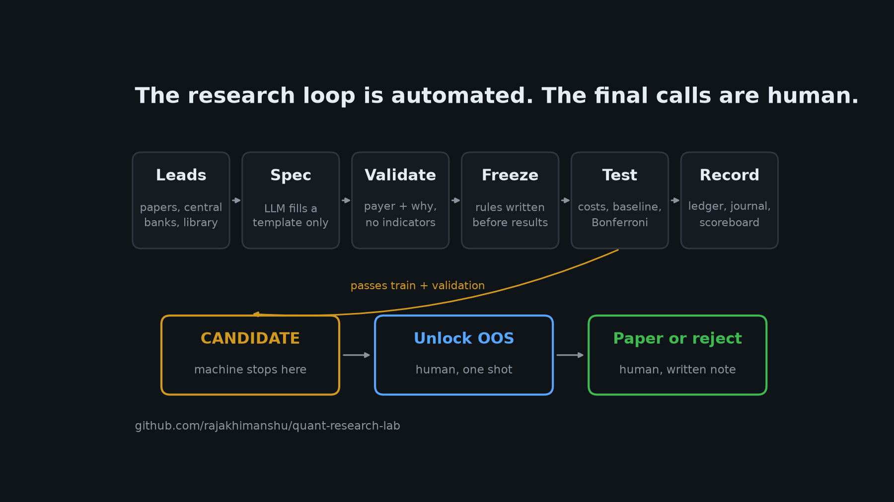
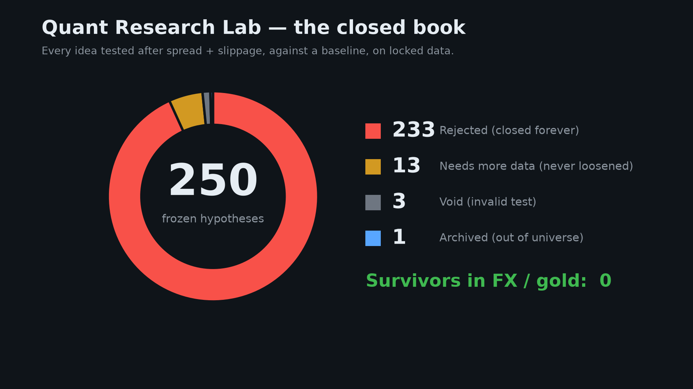

# Quant Research Lab

**An automated research lab for FX majors and gold, built to reject trading ideas honestly.**

Quant Research Lab (internal name **Proofbook**) takes research leads from academic papers, a library of documented market mechanisms, an optional LLM, or your own notes. It turns each lead into a frozen hypothesis with a causal reason to work, tests it after trading costs against a control baseline on locked historical data, and writes the verdict into a permanent public book. The machine stops when an idea clears training and validation. Spending the out-of-sample data and deciding whether to paper trade are human decisions.

> **Not financial advice.** Nothing in this repository is a profitable or recommended strategy. After 250 frozen tests, no FX or gold hypothesis has survived. See [Disclaimer](#disclaimer).



| | |
|---|---|
| **Universe** | 7 FX majors (EURUSD, GBPUSD, USDJPY, AUDUSD, USDCAD, USDCHF, NZDUSD) + XAUUSD |
| **Timeframes** | M5, M15, H1 |
| **Data** | MetaTrader 5 terminal (required, Windows) |
| **Language** | Python 3.12 (the `MetaTrader5` package has no newer wheel) |
| **CLI** | `python -m ats …` |
| **Record** | 250 tests · 233 REJECT · 13 NEEDS_MORE_DATA · 3 VOID · 1 ARCHIVED · **0 survivors** |

---

## Contents

1. [Why this project exists](#1-why-this-project-exists)
2. [Results so far](#2-results-so-far)
3. [The finance: where an edge could come from](#3-the-finance-where-an-edge-could-come-from)
4. [The science: how a hypothesis is tested](#4-the-science-how-a-hypothesis-is-tested)
5. [The engineering: how the lab is built](#5-the-engineering-how-the-lab-is-built)
6. [Lifecycle of a hypothesis](#6-lifecycle-of-a-hypothesis)
7. [Case study: auditing a batch of fake winners](#7-case-study-auditing-a-batch-of-fake-winners)
8. [Getting started](#8-getting-started)
9. [Writing your own hypothesis](#9-writing-your-own-hypothesis)
10. [Known limitations](#10-known-limitations)
11. [Repository map](#11-repository-map)
12. [References](#12-references)
13. [Disclaimer](#disclaimer) · [License](#license)

---

## 1. Why this project exists

Most retail "algo trading" projects search for rules that looked profitable in the past. With enough indicators, parameters, timeframes and symbols, a search will always find something that backtests well, and it will usually stop working the moment real money is involved. The academic literature has a name for this: **backtest overfitting** or **data snooping**. When you try many variations and keep the best one, the best one is mostly luck.

This lab inverts the goal. It is not trying to find a strategy. It is trying to **kill ideas as cheaply and honestly as possible**, so that if something ever survives, the survival means something. Every design choice exists to stop one specific way that researchers fool themselves:

| How researchers fool themselves | What the lab does about it |
|---|---|
| Testing rules that have no reason to work | Every hypothesis must name **who is forced to trade** (the payer) and why. Indicator-based ideas are refused. |
| Choosing rules after seeing the data | Rules are **frozen** to a file, with a timestamp, before the first result is computed. |
| Ignoring trading costs | Every simulated trade pays **spread and slippage** and is measured net of cost. |
| Comparing against nothing | Every hypothesis must beat a **control baseline** under identical conditions. |
| Running many tests and reporting the best | Tests are grouped into families with a **Bonferroni** correction and a weekly **test budget**. |
| Re-running a failed idea with new knobs | A **signature** catches retuned duplicates; closed ideas are listed as do-not-reopen. |
| Peeking at the final test data | The **out-of-sample** segment stays locked until a human spends it, once. |
| Winning often but losing money | A **positive expectancy** gate rejects "high hit rate, negative average" results. |

The lab also keeps a **permanent record of failures**. A public list of 233 rejected ideas, each with the reason it failed, is more useful to the next researcher than a single cherry-picked equity curve.

---

## 2. Results so far



| Decision | Count | Meaning |
|---|---:|---|
| REJECT | 233 | Failed a gate. Closed forever; never retuned. |
| NEEDS_MORE_DATA | 13 | Frozen spec with too few trades. Not loosened to get more. |
| VOID | 3 | Not a valid result (for example, a spec chosen after seeing the full sample). |
| ARCHIVED | 1 | H5, a textbook equity RSI(2) rule from before the universe was locked to FX and gold. Never traded live, and today's validator would refuse it. |
| **Survivors in FX/gold** | **0** | |

Two hypotheses went furthest and are worth reading as examples of how ideas die late:

- **H86, weekend gap fade on G10 pairs.** It cleared train, validation and out-of-sample. A deeper fill audit then showed that the Sunday reopen bar carries spreads far wider than the cost model assumed, which erased the edge. Rejected.
- **H192, gold fade into the 17:30 Xetra close.** It cleared train and validation with p = 0.00017, then failed when the out-of-sample segment was unlocked. Rejected, never retuned.

Full table: [`research/HYPOTHESIS_SCOREBOARD.md`](research/HYPOTHESIS_SCOREBOARD.md) · Every row with its reason: [`research/ledger.yaml`](research/ledger.yaml) · Dated log: [`research/journal.md`](research/journal.md)

---

## 3. The finance: where an edge could come from

### 3.1 The payer principle

A trading edge is a transfer of money from someone to you. If you cannot say who is paying, and why they would keep paying, the most likely explanation for a good backtest is noise. The lab therefore requires every hypothesis to name a **payer**: a participant who must trade at a particular time, size or price for reasons that have nothing to do with short-term profit.

Hypotheses are grouped into three causal categories:

| Category | Idea | Examples |
|---|---|---|
| **Forced flow** | Someone must transact regardless of price, so their flow is predictable in time. | Benchmark fixes (WM/Reuters 16:00 London, LBMA gold auctions), option expiries (NY 10:00 cut), month-end and quarter-end portfolio rebalancing, futures rolls. |
| **Inventory pressure** | Dealers and market makers take the other side of order imbalances and need to offload risk, which can push prices away from fair value briefly. | Stop-loss cascades beyond obvious levels, one-sided runs into a close, inventory unwinds after a large move. |
| **Structural liquidity** | Liquidity is uneven across the day and across markets, so prices can be temporarily wrong where liquidity is thin. | Session opens and closes, weekend reopen gaps, price discovery in a liquid pair leading a less liquid one. |

### 3.2 What the lab refuses, and why

Moving averages, RSI, MACD, Bollinger Bands, Fibonacci levels and support/resistance lines are **descriptions of past price**, not reasons for future price. They do not identify anyone who is forced to trade. They also come with many free parameters (lengths, thresholds, timeframes), which makes them ideal for overfitting. The spec validator rejects these terms outright. Four early EMA-based tests (H13–H16) were run before this rule existed; all four were rejected.

### 3.3 Costs are part of the hypothesis

FX and gold are traded over the counter. A retail trader buys at the ask and sells at the bid, so every round trip loses roughly one spread, plus slippage when the fill is worse than the quoted price. On intraday timeframes these costs are often larger than any plausible edge. The lab charges both on every simulated trade:

| Symbol | Spread (example default) | Slippage |
|---|---:|---:|
| EURUSD | 0.8 pips | 0.2 pips |
| GBPUSD | 1.0 | 0.2 |
| USDJPY | 1.0 | 0.2 |
| AUDUSD | 1.1 | 0.2 |
| USDCAD | 1.5 | 0.2 |
| USDCHF | 1.2 | 0.2 |
| NZDUSD | 1.7 | 0.2 |
| XAUUSD | 200 points ($0.20/oz) | 20 points |

These are the median bar spreads of one commission-free retail MT5 account in 2026. They are **example defaults**. Replace them in [`config/settings.yaml`](config/settings.yaml) with your own broker's medians before trusting any result.

### 3.4 Retail realities

The lab is designed for an individual with retail capital and infrastructure, which shapes what it will test:

- **One symbol, simple rules, clock or OHLC based.** Anything that survives should be implementable as a single MetaTrader 5 Expert Advisor. No grids, no martingale, no portfolios of many pairs before a single survivor exists.
- **Minimum lot size matters.** At 0.01 lots, a small account cannot keep risk near 1% on a 15-pip stop. A first live step, if one ever happens, checks fills and spreads, not returns.
- **The path is fixed:** Python research → paper trading → small live execution check → Expert Advisor. The lab does not skip steps, and nothing has reached paper trading in FX or gold.

---

## 4. The science: how a hypothesis is tested

### 4.1 Treatment versus baseline

Each hypothesis is a controlled experiment. The **treatment** arm contains the trades the hypothesis says should work. The **baseline** arm contains trades taken under the same conditions minus the claimed cause, for example:

- the same rule at a control clock on the same days (if the effect is caused by the 16:00 fix, 11:00 should not show it);
- the opposite side on the same bar (a fade must beat the follow);
- a control day (a weekend gap fade must beat a same-size jump on a normal weekday).

The question is never "did this make money?" but "did this beat an otherwise identical trade that lacks the proposed cause?" A hypothesis with no baseline arm is rejected automatically, because there is nothing to compare it against.

### 4.2 The trade model

Every trade in every template uses the same fill model:

1. A signal is detected on the close of bar *i*. Nothing from bar *i+1* or later is used to decide.
2. Entry is at the **open of bar *i+1***, moved against the trader by spread + slippage.
3. Stop and target are placed at fixed multiples of the 14-period **ATR** (Average True Range) from entry, so risk scales with volatility across pairs and regimes.
4. The trade is walked forward bar by bar. If one bar touches both stop and target, **the stop is assumed to hit first** (the conservative choice when intrabar order is unknown).
5. If neither is hit within the horizon, the trade exits at the close of the last bar.
6. **One position at a time**: a new signal is ignored while a trade is open. Overlapping trades would count the same price move many times and inflate the sample.

Two numbers come out of each trade:

- **Success**: the target was reached before the stop.
- **R multiple**: profit or loss in units of initial risk. A full stop is −1R; a 1:1 target is about +1R minus costs.

### 4.3 Splitting time: train, validation, out-of-sample

Financial data is a single path through time, so the lab splits it chronologically, never randomly:

```
|---------------- train (~60%) ----------------|--- validation (~20%) ---|--- out-of-sample (~20%) ---|
                                         train_end                    val_end                  locked
```

The cut dates are **frozen per data book** in `config/settings.yaml` (for example `fx_m15`: train ends 2025-01-28, validation ends 2025-11-14). They were set before the tests that use them, and they are never moved after seeing a result. Event-count splits would shift every time more data was pulled; calendar locks do not.

- **Train** is where the effect must first appear.
- **Validation** checks that it holds on later data the rule has never been judged on.
- **Out-of-sample (OOS)** is used at most once, by a human, after a hypothesis has cleared both. While OOS is locked, no statistic computed on it is printed or saved, including headline totals.

### 4.4 The statistical test

For each split the lab compares the treatment success rate $p_T$ with the baseline success rate $p_B$ using a **one-sided two-proportion z-test**:

$$
z = \frac{\hat p_T - \hat p_B}{\sqrt{\hat p (1-\hat p)\left(\frac{1}{n_T} + \frac{1}{n_B}\right)}}, \qquad \hat p = \frac{x_T + x_B}{n_T + n_B}
$$

where $x$ is the number of successful trades and $n$ the number of trades in each arm. The null hypothesis is $p_T \le p_B$: the proposed cause adds nothing. A small p-value means the treatment's advantage would be unlikely if the cause did nothing.

### 4.5 Multiple testing

If you run 20 independent tests at α = 0.05, you expect about one false positive even when nothing works. The lab applies a **Bonferroni correction** to every family of hypotheses tested together:

$$
\alpha_{\text{family}} = \frac{0.05}{n_{\text{tests}}}
$$

An automated batch of 8 hypotheses must clear p < 0.00625 on train. The September audit batch of 29 had to clear p < 0.0017. When a human later unlocks OOS for one candidate, the original family size is reused, so unlocking cannot quietly restore α = 0.05.

The automated loop adds a **test budget** (one family per 7 days by default), because the total number of tests ever run is itself a source of false discoveries.

### 4.6 The decision gates

Implemented in `src/ats/research/pipeline.py`, applied in this order:

| # | Gate | Outcome if it fails |
|---|---|---|
| 1 | Train treatment trades ≥ 100 (`min_trades`) | NEEDS_MORE_DATA |
| 2 | A baseline arm exists | REJECT |
| 3 | Train success rate > train baseline rate | REJECT |
| 4 | Train p-value < Bonferroni α | REJECT |
| 5 | Validation trades ≥ max(30, min_trades / 4) | NEEDS_MORE_DATA |
| 6 | \|train rate − validation rate\| ≤ 20 percentage points | REJECT (overfit signature) |
| 7 | Validation success rate > validation baseline rate | REJECT |
| 8 | Mean R > 0 after costs on **both** train and validation | REJECT ("hit-rate mirage") |
| — | All pass | **CANDIDATE**, and the machine stops |

After a human unlocks OOS, a CANDIDATE becomes **OOS_PASS** only if OOS has at least max(30, min_trades / 4) trades, the OOS success rate beats its baseline, OOS mean R is positive after costs, and the train–OOS gap is within 20 points. Otherwise it is rejected, and the OOS segment is spent.

Gate 8 exists because a high hit rate can hide a losing system: winning 60% of trades at +0.5R and losing 40% at −1R is a net loss. Several early "winners" failed exactly this way.

### 4.7 What a REJECT means

A REJECT is permanent. The ledger records it with explicit do-not-reopen notes such as "do not flip to follow", "do not move the clock", "do not loosen the gap filter". Retuning a rejected idea until it passes is the same overfitting the lab exists to prevent, so the signature check also blocks it at the proposal stage.

---

## 5. The engineering: how the lab is built

### 5.1 Architecture

```
                    ┌──────────────────────────── ats lab run ────────────────────────────┐
                    │                                                                     │
 arXiv, BIS, Fed,   │   intake      proposer        spec validator     budget    freeze   │   pipeline (train/val,
 ECB, BoE feeds ────┼─► leads ───► (LLM or hand) ─► + signature  ────► check ──► to    ───┼─► OOS locked, costs,
 mechanism library  │   queue      template spec    dedup              1/week    YAML     │   Bonferroni family)
 manual specs       │                                                                     │         │
                    └─────────────────────────────────────────────────────────────────────┘         ▼
                                                                                             lab book, runs log,
                                                                                             journal, scoreboard,
                                                                                             batch report
                                                                                                    │
                                              CANDIDATE ──► human: ats lab unlock ──► OOS_PASS ──► human: ats lab decide
```

### 5.2 Components

| Module | Responsibility |
|---|---|
| `ats.data.mt5_client` | Connects to a running MetaTrader 5 terminal, resolves broker symbol names, pulls OHLC bars to `data/raw/*.parquet`. |
| `ats.data.clean`, `ats.features.prepare` | Cleans bars (duplicates, gaps, timezone) and adds ATR and session features. |
| `ats.ideas.*` | Research intake: paper monitor (arXiv + central-bank RSS feeds, relevance filter), intake store with URL dedup, mechanism library, Groq client, promotion gate. |
| `ats.lab.templates` | Six event templates, each a closed parameter schema plus a function that turns bars into treatment and baseline trades. |
| `ats.lab.spec` | Validates specs, computes signatures, assigns data books, freezes specs into `config/hypotheses.yaml`. |
| `ats.lab.proposer` | Builds the constrained LLM prompt (template catalogue + rules + do-not-reopen list), parses JSON, records proposals in a queue. |
| `ats.lab.loop` | The cycle: sweep → propose → budget → freeze → test → record. Also the two human gates. |
| `ats.lab.book` | Writes lab rows, the family run log and journal entries. |
| `ats.hypotheses.*` | Event generators: the template engines plus the hand-written modules from the first 250 tests. |
| `ats.research.pipeline` | Loads data, dispatches events, applies the split, runs the statistics and the decision gates. |
| `ats.research.ledger`, `.scoreboard` | Merges the hand-curated ledger with the lab book; renders the public scoreboard. |
| `ats.cli` | The `ats` command line. |

### 5.3 Templates instead of generated code

An LLM asked to "write a strategy" will produce code with hidden degrees of freedom. Here the LLM may only choose one of six templates and fill its parameters, and every parameter has a type, bounds or a fixed list of choices:

| Template | Mechanism | Baseline | Timeframes |
|---|---|---|---|
| `clock_run` | A named clock (fix, auction, session open or close, settlement) forces flow; fade or follow the bar into it. | Same rule at a control clock on the same days. | M5, M15, H1 |
| `session_box` | Stops cluster around a session's opening range; the first break is a stop run (fade) or initiative flow (follow). | Opposite side on the same break bar. | M5, M15 |
| `sweep_reclaim` | Dealers absorb stops just beyond a recent swing; a shallow sweep that closes back inside reverts. | Opposite side on the same sweep bar. | M5, M15, H1 |
| `lead_lag` | Price discovery happens first in the more liquid pair; the follower reprices with a lag. | Opposite side on the same follower bar. | M5, M15 |
| `weekend_gap` | Weekend news reprices with no liquidity; the reopen gap overshoots and is faded. | Fade of a same-size London-open jump on a normal day. | M5, M15, H1 |
| `month_end` | Month-end rebalancing forces flow in the month-to-date direction over the last sessions. | Same follow on mid-month sessions. | M15, H1 |

Shared risk parameters are bounded too: holding horizon 2–48 bars, stop 0.5–3 ATR, target 0.5–4 ATR. A mechanism that fits no template needs a new, reviewed template, not a looser schema.

### 5.4 Validation, signatures and freezing

A spec is accepted only if it:

- names an allowed template, symbols inside the universe, and a timeframe that template supports;
- has a `why` of at least 80 characters and a `payer`, with no banned indicator terms anywhere in the text;
- passes the template's parameter schema and its cross-field rules (for example, the control clock must differ from the treatment clock, and a lead–lag leader must differ from the follower).

Its **signature** is a SHA-1 hash of template, symbols, timeframe and mechanism parameters, excluding `horizon_bars`, `stop_atr` and `target_atr`. Two specs that differ only in risk settings are the same idea, so the second is marked duplicate.

Accepted specs are **appended** to `config/hypotheses.yaml` with an `H` number, the batch id (`family`), the signature, the timestamp and the payer, before the pipeline runs. The file is append-only in practice; the hand-curated `research/ledger.yaml` is never rewritten by the machine.

### 5.5 Data model

| File | Written by | Content |
|---|---|---|
| `config/settings.yaml` | human | Universe, costs, split dates, gates, lab budget. |
| `config/hypotheses.yaml` | human + lab | Frozen specs. |
| `research/lab/proposals.yaml` | lab | Proposal queue with statuses (`queued`, `invalid`, `duplicate`, `rejected_by_model`, `error`, `no_data`, `frozen`). |
| `research/lab/book.yaml` | lab | One row per lab test: decision, template, signature, train/val summary, reason. |
| `research/lab/runs.yaml` | lab | One entry per family: date, n, α, ids, decision counts. |
| `research/lab/reports/<batch>.md` | lab | Human-readable batch report. |
| `research/ledger.yaml` | human | Hand-curated closed book of the first 250 tests, with do-not-reopen notes. |
| `research/journal.md` | human + lab | Dated log of every run and decision. |
| `data/` | `ats pull`, `ats test` | Market data and raw result JSONs. Gitignored. |

### 5.6 Testing and CI

`pytest` runs on synthetic price paths, so it needs no MT5 terminal and no market data. Coverage includes the decision gates, every template on synthetic bars, the spec validator, signature dedup, the budget, the proposer (with a fake LLM), freezing into a temporary file and the ledger merge. GitHub Actions runs the suite on Windows with Python 3.12 on every push.

---

## 6. Lifecycle of a hypothesis

```
lead ─► proposal ─► queued ─► frozen ─► REJECT            (closed forever)
                 │                   ├► NEEDS_MORE_DATA   (wait for data; never loosen)
                 ├► invalid          └► CANDIDATE ─► [human] unlock ─► REJECT
                 ├► duplicate                                        └► OOS_PASS ─► [human] decide ─► PAPER_CANDIDATE
                 └► rejected_by_model                                                             └► REJECT
```

A PAPER_CANDIDATE is still not proof. It means a human has chosen to watch the idea trade on a demo account before any real money is considered.

---

## 7. Case study: auditing a batch of fake winners

A fast batch of 41 tests (H215–H255) produced several apparent winners. An audit found that the wins came from the test harness, not the market:

| Problem | Effect | Fix now built into every template |
|---|---|---|
| Fill at the signal bar's close, no spread | Inflated R in 15 modules | Next-bar open ± cost, net R |
| No baseline arm | Nothing to beat | Baseline required; treatment-only designs rejected |
| Hit rate up, mean R ≤ 0 | "Hit-rate mirage" | CANDIDATE and OOS_PASS need mean R > 0 |
| Overlapping 48-bar holds | Sample inflated about 6×, fake p-values | One position at a time |
| α = 0.05 per test, plus reruns | Multiple-testing leak | One Bonferroni family of 29 (α = 0.0017) |
| Spec chosen after seeing the full sample | Out-of-sample snooped (H255) | Marked VOID, not a result |

After the fixes, the batch's best result (H234, a gold trend-pullback rule) fell from n = 2,766 trades to n = 199 and from a striking p-value to p = 0.15. Its "edge" had been overlapping entries plus gold's long-run uptrend. The whole family was re-run: zero candidates. This audit is why the automated lab enforces these rules by construction instead of by discipline.

---

## 8. Getting started

### Requirements

- Windows (the `MetaTrader5` Python package is Windows-only)
- Python **3.12**
- A MetaTrader 5 terminal logged in to any broker; a demo account is enough
- Optional: a free [Groq](https://console.groq.com) API key for LLM proposals

### Install

```powershell
git clone https://github.com/rajakhimanshu/quant-research-lab.git
cd quant-research-lab
py -3.12 -m venv .venv
.\.venv\Scripts\Activate.ps1
pip install -e ".[dev]"
copy .env.example .env          # optional: MT5 terminal path, GROQ_API_KEY
pytest -q                       # runs without MT5 or data
```

### Pull data and run the lab

Open MetaTrader 5 and log in, then:

```powershell
python -m ats doctor                                     # checks Python 3.12 and the MT5 connection
python -m ats pull                                       # downloads OHLC into data/raw
python -m ats lab templates                              # what the lab can test
python -m ats lab propose --file examples/proposal.yaml  # queue a hand-written spec
python -m ats lab run --dry-run                          # show what would be frozen
python -m ats lab run --no-sweep                         # freeze and test one family
python -m ats lab status                                 # queue, open candidates, lifetime test count
```

If something reaches CANDIDATE:

```powershell
python -m ats lab unlock --id H260_example --confirm                    # spends OOS once
python -m ats lab decide --id H260_example --paper --note "your reason" # only after OOS_PASS
python -m ats lab decide --id H260_example --reject --note "your reason"
```

### All commands

| Command | Purpose |
|---|---|
| `ats doctor` | Environment and MT5 check |
| `ats pull` | Download OHLC to `data/raw` |
| `ats lab templates \| propose \| run \| status \| unlock \| decide` | The automated research loop and the human gates |
| `ats test --id H…` | Re-run one frozen hypothesis (OOS locked) |
| `ats ledger` | Print the closed book |
| `ats scoreboard` | Rebuild the public scoreboard |
| `ats intake …` | Paper monitor, intake review, promotion gate |

`ats lab run` options: `--no-sweep`, `--no-propose`, `--no-test`, `--max-batch N`, `--force` (ignores the weekly budget), `--dry-run`.

---

## 9. Writing your own hypothesis

A spec is a short YAML file. This one is in [`examples/proposal.yaml`](examples/proposal.yaml) and only shows the format; it has no claimed edge.

```yaml
name: London 4pm fix fade (format example)
why: >-
  Asset managers and corporates benchmarked to the WM/Reuters 16:00 London fix must
  complete their orders inside the fix window, so flow into the fix is one-sided and
  should partly reverse once the window closes and that demand disappears.
payer: Benchmark-tracking funds and corporates that must transact at the 16:00 fix
causal_category: forced_flow
template: clock_run
symbols: [EURUSD]
timeframe: M15
params:
  tz: Europe/London
  treat_hour: 16      # the clock that should show the effect
  base_hour: 11       # the control clock that should not
  mode: fade
  min_prior_atr: 0.5
  horizon_bars: 4
  stop_atr: 1.0
  target_atr: 1.0
```

Good hypotheses share three features: the payer is specific, the timing comes from the mechanism rather than from the data, and the baseline isolates the claimed cause. Before writing one, check the ledger's do-not-reopen list; many obvious ideas are already closed.

---

## 10. Known limitations

Honesty about the lab's own weaknesses is part of the method:

- **The significance test is on hit rate, not on R.** Expectancy is required to be positive but is not separately tested for significance. A distributional test on R (for example, a bootstrap) would be stricter.
- **Bonferroni is conservative and per family.** It ignores the lifetime number of tests. With hundreds of tests, one OOS_PASS can still be luck; paper trading is the final filter.
- **Bar data, not ticks.** Intrabar order is unknown (the stop-first rule is conservative but approximate), and spreads are modelled as constants. H86 showed that real spreads at illiquid moments can be far wider.
- **Limited history.** Many brokers serve about 100,000 bars per symbol and timeframe, which is only about 16 months of M5 data. Some ideas cannot reach 100 trades.
- **One broker's costs.** The defaults come from one account. Different brokers, account types and execution venues will change results.
- **Templates bound the search.** That is deliberate, but some real mechanisms will not fit any template until one is added.
- **No live-trading code.** There is intentionally no execution engine or Expert Advisor. None will be built until something survives paper trading.

---

## 11. Repository map

```
config/            settings.yaml (costs, splits, gates, lab budget), hypotheses.yaml (frozen specs),
                   intake.yaml (leads), mechanism_library.yaml (documented payers)
src/ats/data/      MT5 client, cleaning, calendar
src/ats/features/  ATR, sessions, levels
src/ats/ideas/     research intake: paper monitor, intake store, LLM client, promotion gate
src/ats/lab/       automated loop: templates, spec, proposer, loop, book
src/ats/hypotheses/ event generators (template engines and the first 250 tests)
src/ats/research/  pipeline, statistics, ledger, scoreboard, deep audits
research/          ledger, journal, scoreboard, test protocol, intake notes, lab book and reports
docs/              lab architecture (LAB.md), layout, naming
examples/          example proposal
tests/             pytest suite on synthetic data
data/              market data and results (gitignored)
```

More detail: [`docs/LAB.md`](docs/LAB.md) · [`research/HOW_WE_TEST.md`](research/HOW_WE_TEST.md) · [`research/INTAKE_PIPELINE.md`](research/INTAKE_PIPELINE.md) · [`CONTRIBUTING.md`](CONTRIBUTING.md)

---

## 12. References

Background reading behind the design:

- Bailey, D. H., Borwein, J., López de Prado, M., & Zhu, Q. J. (2014). *Pseudo-Mathematics and Financial Charlatanism: The Effects of Backtest Overfitting on Out-of-Sample Performance.* Notices of the AMS.
- Harvey, C. R., Liu, Y., & Zhu, H. (2016). *…and the Cross-Section of Expected Returns.* Review of Financial Studies.
- White, H. (2000). *A Reality Check for Data Snooping.* Econometrica.
- López de Prado, M. (2018). *Advances in Financial Machine Learning.* Wiley.
- Evans, M. D. D., & Lyons, R. K. (2002). *Order Flow and Exchange Rate Dynamics.* Journal of Political Economy.
- Melvin, M., & Prins, J. (2015). *Equity Hedging and Exchange Rates at the London 4 p.m. Fix.* Journal of Financial Markets.

---

## Disclaimer

This is a research and education project. It is **not financial advice**, not a signal service, and not an offer to manage money. Every hypothesis in the book is closed or unproven, and none should be traded. Backtests, including honest ones, do not predict future results. Trading leveraged FX and gold can lose more than your deposit. Cost defaults are examples from one retail account; your broker will differ. You are solely responsible for anything you do with this code.

## License

[MIT](LICENSE)
